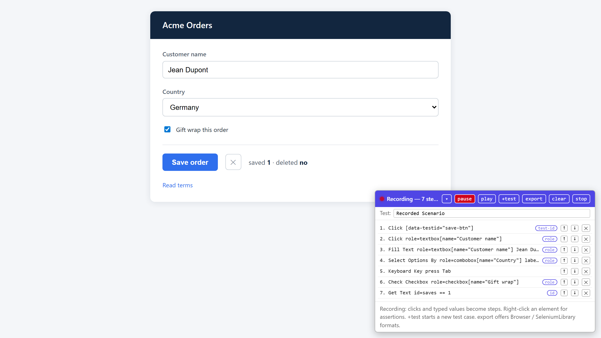

> 🇫🇷 Version française : [README.fr.md](README.fr.md)

# rf-web-recorder

**A universal test recorder for modern web interfaces that emits Robot Framework
code targeting the [Browser library](https://robotframework-browser.org/)
(Playwright-based).**



*The recorder panel over the page being tested: each click, keystroke or
selection becomes a readable Robot Framework step with a stable locator, and a
right-click adds an assertion (step 7).*

Framework-agnostic: it works the same on React, Angular, Vue, vanilla HTML and
Web Components pages, because it never talks to a framework — it reads the
standards the frameworks all end up producing: the DOM, ARIA roles and
accessible names.

Two delivery modes, one identical bundle:

1. **Chrome extension (Manifest V3)** — one click on the toolbar icon.
2. **Standalone console snippet** — paste one file into DevTools. For
   locked-down environments where installing extensions is not allowed.

Zero dependencies anywhere: no npm packages, no bundler, no build toolchain
beyond Node itself. License: Apache-2.0.

## Why not Playwright codegen or Selenium IDE?

They are fine recorders — for their own ecosystems. `playwright codegen` emits
Playwright test code (TypeScript/Python/etc.), Selenium IDE emits its own `.side`
format or Selenium bindings. **Neither emits Robot Framework Browser-library
keywords**, so RF teams end up hand-translating every recorded step.
rf-web-recorder emits `Click` / `Fill Text` / `Get Text` lines you can paste
into a `.robot` file unchanged — or export directly as a runnable suite, or as
a **resource-first pair** where locators live in a `.resource` file and the
test reads like business language (the pattern RF teams actually maintain).
It also keeps the good parts of the Selenium IDE workflow — in-panel replay,
in-place step editing, multiple test cases per session, re-import of an
exported suite — without adopting its control-flow recording (see the
deliberate non-goals below).

## Quickstart

### A. Console snippet (no install)

```
node build.mjs
```

Then open your app, open DevTools (F12) → Console, and paste the whole content
of `dist/recorder_snippet.js`. The panel appears bottom-right; you are in
capture mode. `Esc` stops (steps are kept; re-paste or `window.__RFREC.start()`
resumes).

> ⚠️ Only paste code you built yourself from source you can read
> (`node build.mjs`). Pasting unreviewed JavaScript into the DevTools console
> gives it full control of the page (self-XSS) — never extend this habit to
> code from chats, gists or websites you have not audited. See
> [Security and privacy](#security-and-privacy).

### B. Chrome extension

```
node build.mjs        # generates extension/recorder.js
```

Then `chrome://extensions` → enable *Developer mode* → *Load unpacked* → select
the `extension/` folder. Click the toolbar icon → **Start capture** or
**Start record**. The keyboard shortcut `Alt+Shift+U` toggles recording without
opening the popup; the badge shows `REC` while recording.

> The extension ships without icon files on purpose (keeps the repo fully
> text-based and buildable); Chrome shows its default puzzle-piece icon.
> Add PNGs + an `icons` manifest key if you publish to the Web Store.

### Replaying an export

```
pip install robotframework robotframework-browser
rfbrowser init
robot recorded-scenario.robot
```

## Locator strategy (the heart of the project)

For every element the recorder generates candidates in priority order and picks
the **first one that resolves uniquely on the page** (uniqueness is re-checked
at capture time). The winning strategy is shown as a chip on each step so you
can judge robustness at a glance.

| # | Strategy | Example | Notes |
|---|----------|---------|-------|
| 1 | Test id attribute | `[data-testid="save-btn"]` | `data-testid`, `data-test-id`, `data-test`, `data-cy` |
| 2 | Computed role + accessible name | `role=button[name="Submit"]` | Explicit `role` attr or implicit HTML semantics; accname from `aria-label(ledby)`, `<label>`, `alt`, text… The "user intention" locator. |
| 3 | Placeholder (form fields) | `[placeholder="Search"]` | |
| 4 | Stable id | `id=login-form` | Auto-generated ids (`ember123`, `:r0:`, `radix-…`, 3+ digit runs) are rejected |
| 5 | Short unique text | `text="Log in"` | Trimmed, ≤ 40 chars |
| 6 | Anchored CSS path | `[id="main"] > form:nth-of-type(1) > button:nth-of-type(2)` | Nearest stable-id ancestor + `nth-of-type` chain. Always available. |

Shadow DOM: Playwright's CSS engine pierces **open** shadow roots automatically,
so plain CSS paths keep working on Web Components pages; the path builder hops
open shadow boundaries with a descendant combinator.

## Recorder behavior

**Capture mode** (default): hovering highlights the element and shows its best
locator; a click copies a ready-to-paste `Get Element    <locator>` line and
lists the element in the panel with one copy button per candidate strategy.

**Record mode** (`rec` button, popup, or `Alt+Shift+U`): your interactions
become ordered steps —

| Interaction | Emitted keyword |
|---|---|
| click | `Click    <locator>` |
| type in input/textarea | `Fill Text    <locator>    <value>` (passwords → `<PASSWORD>`, payment/OTP fields → `<SECRET>`) |
| select an option | `Select Options By    <locator>    label    <label>` |
| check / uncheck a checkbox | `Check Checkbox` / `Uncheck Checkbox` |
| click a radio button | `Click    <locator>` |
| press Enter / Tab | `Keyboard Key    press    Enter` |
| hash / history navigation | `Wait For Load State    load` |

Compaction is automatic: near-simultaneous duplicate steps dedup (a deliberate
second click on the same button IS kept), consecutive fills on the same field
keep only the final value, consecutive load-waits collapse. Steps — and the
recording state — survive page reloads (sessionStorage): after a full-page
navigation, re-inject (re-paste the snippet or press `Alt+Shift+U`) and
recording resumes where it left off. Steps are reorderable (↑ ↓) and
deletable (✕) in the panel, and the test name is editable.

**In-panel replay** (`play` button): the recorded steps replay sequentially
(~350 ms apart) against the live page — clicks dispatch real
mousedown/mouseup/click events, fills set the value and dispatch input+change,
selects pick the option by label, presses land on the focused element, and the
recorded **assertions are evaluated in place** (visible / text / value /
count). Each step's element is highlighted as it runs and the current row is
marked in the panel; a failure stops the replay, marks the row red and names
the reason in the hint line; success shows `replay OK (N steps)`. `Esc`
cancels a running replay. Replay never records its own synthetic events.
Fills go through the element's **native value setter** with real focus, so
controlled inputs (React & co) see them; frameworks that only trust genuine
user gestures may still ignore synthetic clicks — the exported suite replays
through the real Browser library either way.

**In-place editing**: double-click any step row to edit it inline — the value
for value-bearing steps (fill / select / assertions), otherwise the key
(press), the scenario name (markers) or the locator. Enter commits, Escape
cancels. Editing a locator by hand clears its recorded strategy chip and CSS
fallback (they no longer describe the new locator).

**Multiple test cases per session** (`+test` button): name the next scenario
in the inline prompt and keep recording — a scenario marker row
(`— Test: name —`) is appended, and every export splits the recording into
multiple `*** Test Cases ***` entries: the first test carries the editable
test name and the `New Browser`/`New Page` bootstrap, each marker names the
next test, and later tests **continue the same browser session** (no
re-bootstrap). Replay treats markers as separators.

**Assertion menu**: while recording, **right-click** any element:

| Menu item | Emitted keyword |
|---|---|
| Assert visible | `Get Element States    <loc>    contains    visible` |
| Assert text | `Get Text    <loc>    ==    <current text>` |
| Assert value | `Get Property    <loc>    value    ==    <current value>` |
| Assert count | `Get Element Count    <loc>    ==    <n>` |

The menu closes on Escape or click-away; the default context menu is only
suppressed while record mode is on.

## Keyboard shortcuts

| Shortcut | Effect |
|---|---|
| `Alt+Shift+U` | Toggle recording (extension; injects the recorder if needed) |
| Right-click | Assertion menu (record mode only) |
| Double-click a step row | Edit the step inline (Enter commits, Escape cancels) |
| `Esc` | Cancel a running replay, else close the assertion menu, else stop the recorder (steps kept) |

## Export formats

The panel's `export` button offers five formats (the popup's **Export** uses
the first):

1. **Full `.robot` suite (Browser)** — `Library    Browser`, one test case named
   from the editable test-name field, starting with
   `New Browser    chromium    headless=False` and `New Page    <url>`.
   Downloaded and copied to the clipboard.
2. **Resource-first pair (Browser)** — `recorded_keywords.resource` (each
   distinct locator becomes a `${LOC_<N>_<SLUG>}` variable + small action
   keywords like `Fill Username`) and a `.robot` suite that calls **only those
   keywords**: locators never appear in the test. When a step's recorded
   CSS-path fallback differs from its winning locator, the resource also gets
   a `${LOC_<N>_<SLUG>_FALLBACK}` variable and the keyword body becomes
   self-healing Robot Framework control flow:

   ```robotframework
   Click Username
       ${found}=    Get Element Count    ${LOC_1_USERNAME}
       IF    ${found} > 0
           Click    ${LOC_1_USERNAME}
       ELSE
           Log    Primary locator not found - falling back to the recorded CSS path    WARN
           Click    ${LOC_1_USERNAME_FALLBACK}
       END
   ```

   The primary locator is tried first; the CSS path only steps in when it no
   longer matches, and the WARN makes the drift visible in the log instead of
   hiding it. Value-carrying keywords keep their `[Arguments]` and use the
   argument in both branches. (The SeleniumLibrary emitter is deliberately
   unchanged: it already consumes the CSS fallback directly for `role=`/`text=`
   locators, so an IF/ELSE would just retry the same selector.)
3. **Full `.robot` suite (SeleniumLibrary)** — same recording, emitted as
   SeleniumLibrary keywords (`Click Element`, `Input Text`,
   `Select From List By Label`, `Element Text Should Be`,
   `Press Keys    None    ENTER`…), bootstrapped with
   `Open Browser    <url>    Chrome`.
4. **Resource-first pair (SeleniumLibrary)** — the same locator-free pattern,
   SeleniumLibrary flavour.
5. **Plain step body** — clipboard only (Browser keywords), for pasting into an
   existing test.

The same menu also offers **Import .robot…**: pick a previously exported
Browser-library suite and it is parsed back into the step list (replacing the
current steps), including its test-case names — multiple test cases become
scenario markers, the first one restores the test name, `New Page` restores
the start URL. Lines the parser does not understand (resource keyword calls,
`[Tags]`, `Log`…) are counted in the hint as skipped — never silently
dropped. Export → import → export round-trips the supported step set.

### SeleniumLibrary locator translation

Selenium has no Playwright selector engines, so the adapter translates each
recorded locator:

| Recorded (Browser/Playwright) | Emitted (SeleniumLibrary) |
|---|---|
| `[data-testid="save"]`, `[placeholder="…"]`, CSS paths | `css:` + the same selector |
| `id=login` | `id:login` |
| `role=button[name="Submit"]`, `text="…"` | `css:` + the **CSS-path fallback** recorded with every step |

Steps recorded before v0.2 (no CSS fallback stored) that used a `role=`/`text=`
selector are kept as `# untranslatable…` comments — nothing is silently
dropped. One honest caveat: Playwright CSS pierces open shadow roots,
Selenium CSS does not — steps captured inside shadow DOM may not replay under
SeleniumLibrary.

## Security and privacy

- **Recorded values persist in clear text** in the tab's `sessionStorage`
  (`__rfrecSteps`) — that is what lets a recording survive page reloads.
  Everything typed while recording (except masked sensitive fields, below) is
  readable by any script running on the same origin and stays there until the
  panel's `clear` button is used or the tab is closed. Clear the recording
  when you are done, and avoid recording real personal data on pages you do
  not trust.
- **Sensitive fields are masked at capture time.** Password inputs record
  `<PASSWORD>`; payment and one-time-code fields record `<SECRET>` (detected
  via `autocomplete` tokens — `cc-number`, `cc-csc`, `cc-exp`,
  `one-time-code`, `current-password`, `new-password` — or a
  name/id/aria-label that looks like a card number / CVC / OTP field). The
  real value never reaches the step list, sessionStorage, the clipboard or an
  export; replace the placeholder with a Robot Framework variable in the
  exported suite. Detection is heuristic: review an export before sharing it.
- **The console snippet is self-XSS-shaped by nature**: it only exists for
  environments where extensions are forbidden. Build it yourself, read it if
  you want (it is plain concatenated source), and never paste code you have
  not audited into a console.

## Development

```
node build.mjs               # concatenates src/ -> dist/recorder_snippet.js + extension/recorder.js
node --test "test/*.test.mjs"  # unit tests (node:test, no jsdom — core is duck-typed)
node package_extension.mjs   # zips extension/ -> dist/rf-web-recorder-extension-<version>.zip
npm run test:e2e             # optional E2E: drives the BUILT bundle in a real Chromium page
```

The E2E suite (`test/e2e/recorder_live.robot`) is the one part of the repo
with dependencies, and they are the ones you already have as a user of the
exports: `pip install robotframework robotframework-browser` + `rfbrowser
init`. It injects `dist/recorder_snippet.js` into a fixture checkout page and
verifies live: sensitive-field masking (password / card / CVC / OTP never
reach sessionStorage or an export in clear text), recording, resume after a
page reload, in-page replay, and both export flavours.

Layout:

| Path | Role |
|------|------|
| `src/core/locators.js` | Computed role, accessible name, CSS path, candidate generation + uniqueness scoring. Pure, duck-typed. |
| `src/core/steps.js` | Step model + dedup/compaction rules. Pure. |
| `src/core/emit_browser.js` | Step → Browser-library keyword lines; suite builder; resource-first builder. Pure. |
| `src/core/emit_selenium.js` | Second emission adapter: step → SeleniumLibrary keyword lines, with Browser→Selenium locator translation (CSS fallback per step). Pure. |
| `src/core/resolve.js` | The inverse of locator generation: selector → element(s) (`resolveSelector`/`countSelector`), replay planning (`planStep`) and in-place assertion evaluation (`evalAssertion`). Pure, duck-typed. |
| `src/panel/panel.js` | Floating draggable panel, overlay, floating menu, inline editors, replay row status. Browser-only. |
| `src/recorder.js` | Event wiring: capture/record modes, in-panel replay, assertion menu, persistence, export + .robot import. |
| `src/main.js` | `window.__RFREC` bootstrap (start/stop/export API). |
| `extension/` | MV3 extension (`recorder.js` there is generated by the build). |
| `test/` | `node --test` suites for the pure core + build outputs. |
| `test/e2e/` | Optional Robot Framework Browser suite driving the built bundle in real Chromium (masking, recording, resume, replay, exports). |

The `core/` modules never require a real DOM: they accept any object with
`tagName` / `getAttribute()` / `textContent` / `parentElement` / `children`…
That is what makes them unit-testable with tiny fake nodes — the real DOM
just happens to satisfy the same interface at runtime.

## Deliberate non-goals

- **No control-flow recording** (no if/else, loops or variables captured from
  the UI, unlike Selenium IDE): logic belongs in Robot Framework — resource
  keywords, templates, `IF`/`FOR` written where they can be reviewed and
  maintained — not inside a recording. A recording is a linear draft; the
  only control flow the recorder ever emits is the locator-fallback pattern
  above, and it generates it, it does not record it.

## Known limitations

- A field that fires a second native `change` on blur (after other steps) is
  recorded again — harmless on replay, delete the extra step in the panel.
- Pressing Enter on a focused button records both the key press and the
  browser-synthesized click.
- A full-page navigation unloads the recorder: steps AND the recording state
  are kept, but the recorder must be re-injected (`Alt+Shift+U` or snippet
  re-paste) before the next interactions are captured.
- `<input type="file">` changes are not recorded — a real upload needs a
  hand-written `Upload File By Selector`.
- Cross-origin iframes get their own panel only in extension mode (the snippet
  cannot cross origins; the extension injects with `allFrames` where allowed).
- Locator uniqueness is evaluated at capture time on the current DOM state
  (open shadow roots included).
- The anchored CSS path's uniqueness is verified with the page's own CSS
  engine; when the target sits in a shadow tree that engine cannot see into,
  the construction of the path is trusted instead of re-verified.

## License

Apache-2.0. The locator core was originally developed for the SAPFX project by
the same author — see [NOTICE](NOTICE).
